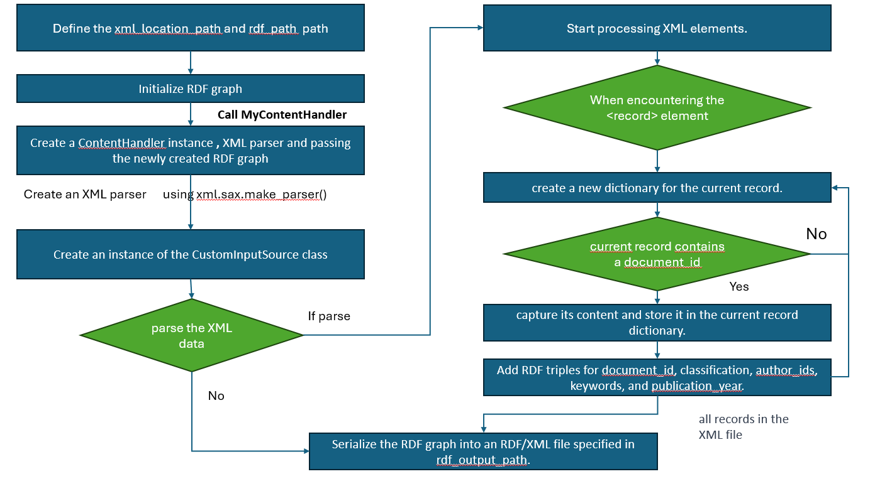
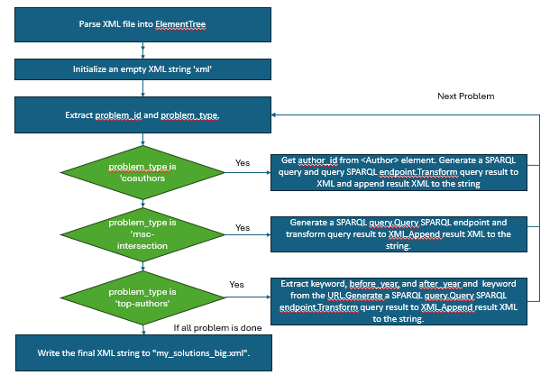

# Table of Contents

1. [Problem Description](#1.Problem Description) 

2. [Introduction](#2.Introduction) 

3. [Requirements](#3.Requirements)

4. [Installation](#ins)

5. [Code description](#CD)

6. [Running the Scripts](#RC)

7. [Evaluation of the Solution](#ES)

8. [flow chart](#FC)

----------------------------------------------------------
## 1. Problem Description :-

In this subproject, I work with a large dataset of mathematical publications provided by **zbMATH Open**. The main goal is to model the dataset in **RDF (Resource Description Framework)**, load it into a **Blazegraph** triplestore, and answer complex semantic queries using **SPARQL**.

Each publication in the dataset contains structured metadata including:
- **Document IDs**
- **Classifications** (based on the Mathematics Subject Classification - MSC)
- **Author identifiers**
- **Keywords**
- **Publication years**

Three types of semantic queries are defined:
- **Co-authors**: Retrieve all co-authors for a given author.
- **MSC Intersection**: Find publications that belong to the intersection of two or more MSC categories.
- **Top Authors**: Identify the top 10 authors with the most publications for a given keyword within a specified year range.

The solution pipeline involves:
1. **Parsing** an XML dataset of publication metadata.
2. **Transforming** the dataset into RDF triples.
3. **Uploading** the RDF to Blazegraph.
4. **Formulating SPARQL queries** to solve each problem type.
5. **Extracting and converting** query results into XML-based solution files.

----------------------------------------------------------
## 2. Introduction :-

This repo includes: 

- xml2rdf_mini.py and xml2rdf_big.py for converting XML data to RDF format
- query_publication_big.py and query_publication_mini.py for loading and querying publication data using SPARQL queries and generating solution files.
- rdf_tripls_mini.rdf which includes the generated RDF tripls from parsing the mini dataset
- solutions_mini.xml and solutions_big.xml  Here, you can find the solutions to the "problems-mini.xml" and "problems-big.xml" files.

----------------------------------------------------------

## 3. Requirements

- Libraries: rdflib, xml.sax, requests, io, xml.etree.ElementTree and urllib.parse
- A local SPARQL server (Blazegraph)

----------------------------------------------------------

## 4. Installation

- Before running the scripts, install the required Python libraries.
- Ensure your SPARQL server is running locally and accessible.
- Update the file paths in the scripts to point to your XML and RDF files.

## 5. Code description

### - xml2rdf_big.py

- This script reads publication data from an XML file, convert this data into RDF format, and then save the RDF data to a file. This is useful in scenarios where one needs to integrate XML-based bibliographic data into RDF-based data stores.

- The script specifies the paths for the input XML file and the output RDF file.Then It calls convert_xml_to_rdf with these file paths to perform the conversion.

- We use SAX parsing because it is more efficient for large datasets and complex XML structures.

- convert_xml_to_rdf Function creates an RDF graph and a custom XML parser with MyContentHandler as the content handler.
It parses the XML file located at xml_path and then serializes the RDF graph into RDF/XML format, saving it to rdf_output_path.

- CustomInputSource Class is used to create a custom input source for the XML parser.
It takes a file path, opens the file, and returns a file object, skipping the first line 

- MyContentHandler Class is used to parse the XML file.It initializes variables to keep track of the current XML element, a buffer to store text content, and a dictionary (currentRecord) to hold data of a publication record.

- The startElement and endElement methods handle the start and end of XML elements, respectively. They parse relevant data  and store it in currentRecord.The characters method appends text content to the buffer. Once an entire record is parsed, the data is added to an RDF graph , creating RDF triples using the zbMATH namespace and standard RDF terms.

### - xml2rdf_mini.py 

- This script transforms mini-dataset.xml into RDF triples.The script uses XML parsing, data extraction, and RDF graph construction. It utilizes xml.etree.ElementTree for parsing data.

- the extract_information function to retrieve document details like ID, author IDs, classifications, keywords, and publication years

- RDF Graph Construction employs `rdflib` to create an RDF graph, establishes the zbMATH namespace for triples creation and links documents with related classifications, authors, keywords, and publication years.

- URIs are generated as specified in the assignment sheet for each entity using the zbMATH namespace.

- Then the RDF graph is serialized into an RDF/XML format.

### - query_publication_big.py and query_publication_mini.py

This Python script is used to interact with a SPARQL endpoint, process SPARQL query results, and perform various tasks related to RDF data manipulation.
We have a several functions for interacting with RDF data and a SPARQL endpoint:
- transform_xml Function:

    Transforms XML output from a SPARQL query into a specific XML structure.Parses the input XML, creates a new XML tree , and iterates over SPARQL results. Depending on the type such as 'coauthors', it extracts relevant data (authors, papers) from the SPARQL results and adds them to the XML tree. and converts the modified XML tree back to a string format for output.

- delete_tripls Function:

    Sends a POST request to a specified SPARQL endpoint URL to delete all triples (clears the database). Then Prints the response status code and text for debugging or confirmation.

- load_tripls Function:

    Loads RDF triples from a specified file path into a SPARQL endpoint .  then constructs a SPARQL LOAD query and sends a POST request and check the response status and prints relevant messages.

- query_tripls Function:

    Sends a SPARQL query to a SPARQL endpoint and returns the result. Handles HTTP response, returning the text content if successful or printing error information.

- get_query Function:

    Constructs a SPARQL query to find coauthors of a given author,intersections or  top authors based on certain criteria (keyword, publication years)..

----------------------------------------------------------

## 6. Running the Scripts

### xml2rdf_big.py or xml2rdf_mini.py
Converts an XML file to RDF format:

    python xml2rdf_big.py
    or
    python xml2rdf_big.py

Make sure to set the correct path for the xml_location_path and rdf_path variables in the script.

### query_publication_big.py or query_publication_mini.py
Executes various SPARQL queries and processes the results:

    python query_publication_big.py
    or
    python query_publication_mini.py

Ensure that the SPARQL endpoint URL and file paths are correctly set in the script.

----------------------------------------------------------

## 7. Evaluation of the Solution

- The xml2rdf_mini.py and xml2rdf_big.py scripts effectively convert XML data to RDF, making it easier to integrate into semantic web applications.
- We used xml.etree.ElementTree for parsing the mini-dataset, the problem files and results of the GET queries. But for the complete dataset we used SAX parsing as it is more effictive in this case. We can say that they were good choices.
- SAX parsing was used , and it is more memory-efficient than DOM.
- The query_publication_big.py and query_publication_mini.py scripts demonstrate the flexibility of SPARQL for various query types.
- The big data Large data is converted and uploaded as a single file. In another case, we can split the data and convert it into multiple sub-files, which may take more time.

-----------------------------------------------------------

## 8. Flow chart

### xml2rdf_big.py

### query_publication_big.py

